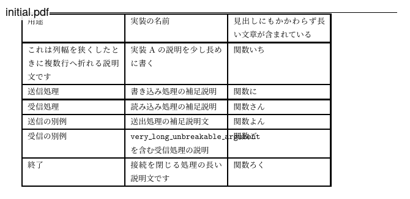

# table-width-opt

LaTeXの表環境の最適な列幅を探索するやつ。

- `tabular`、`tabulary`、`longtable`に対応
- 組版は`uplatex`と`dvipdfmx`が前提
- 表の列指定子は、すべて`p{...}`（または`m{...}`）で設定される（右寄せとか必要なら列幅を最適化してから個別に`{...}>`で設定する）



詳しいことが知りたければ`doc/SPEC.md`に何か書いてあります（エージェントによる執筆）。

## ざっくりとした使い方

```bash
$ ./target/release/table-width-opt optimize \
  --tex table-source.tex \                    # 表が含まれているTeXソース
  --preamble examples/minimal-preamble.tex \  # \documentclassから\begin{document}までに使いたいやつ
  --work-dir /tmp \                           # uplatexの作業ディレクトリ
  --out-colspec out.colspec \                 # 割り出した列指定子
```

## 表の指定方法

デフォルトでは`table-source.tex`の先頭の表だけを処理する。
それ以外の表を処理するには`--table-index`か`--label`を指定する。
指定すべき値は`extract`というサブコマンドで`--list`オプションを指定するとわかる。

```bash
$ ./target/release/table-width-opt extract --tex ../../book/book.tex --list
[0] （表1のキャプション）  5列  colspec=|p{7.0pc}|m{2.00pc}|m{2.00pc}|m{2.00pc}|m{2.00pc}|
     label=table1
[1] ...
```

## 人間による試行に便利なオプション

探索では、各列に右余白ができないように切り詰める→セル内の改行がなるべくバランスするような幅を探索する、という処理を繰り返す。
したがって、「初期値の状態でセル内にどんな感じに改行が発生するか」によって結果が大きく変わる。
とくに`l`や`r`といった古い列指定子では、LaTeXがそれらで組んだ結果が初期値になることから、いまいちな結果になることが多い。

逆に言うと、初期値をうまく設定することで最終的な列間の重みをいい感じに調整できる可能性がある。
そのためのオプションとして``--colspec '...`が用意されている。

なお、人間による試行では探索の回数（デフォルトは24で、これが最大）も指定したいことが多いので、`--max-iter `というオプションも用意されている。
また、最終的な組版結果をPDFで見たいことも多いので、`--out-pdf out.pdf`というオプションもある。

試行錯誤にあたって途中経過を観察するには、このへんのサブコマンドを使うとよい。

- observe --pdf out.pdf --out metrics.json
- report --pdf out.pdf

## ビルド

Rustで実装されているので、cargoを使う。

```bash
$ cargo build --release
```

このへんに依存している。

- Rust 2021
- [Z3](https://github.com/Z3Prover/z3)（`libz3`。ビルド時に`cmake`が必要になることがあります）
- PDF計測: [pdfium-render](https://crates.io/crates/pdfium-render)（システムのpdfium共有ライブラリ）

テストではPDF計測のための回帰用フィクスチャ`tests/fixtures/`を使う。

```bash
$ cargo test --lib
```
